摘要
====

报告着重阐述了“失物招领管理系统”的整体开发过程。介绍了系统的开发环境以及开发工具，对于设计思想和设计流程也做出了全面的叙述，并且具体剖析了系统各个功能的实现过程以及详细设计过程，在绘制简单系统功能模块图的同时，力求更加清晰地表明设计思想以及对整个程序设计的规划及具体实现。

根据实际需求，本网站的设计采用模块化的设计思想，在Win10操作系统环境下，搭建Java运行环境Tomcat8.5
HTTP服务器，通过使用JSP（Java Server
Pages）脚本语言完成动态的、交互的web服务器应用程序，实现本系统的主要功能，包括会员在前台对新闻信息、失物信息、招领信息浏览，注册后可以发布失物信息和招领信息等功能。管理员在后台进行的失物信息管理、招领信息管理、新闻信息管理、失物信息审核管理、会员信息管理、系统简介管理等功能。

本系统具有多方面特点：系统功能完备，使用方便简捷，人性化的界面，大大方便了管理人员和会员发布失物招领信息，提高了失物认领效率，为失主获知信息提供了便捷的途径。

 目 录
=========

[摘要 I](#摘要)

[目 录 II](#目-录)

[前言 1](#前言)

[1 引言 2](#引言)

[1.1 开发背景 2](#开发背景)

[1.2课题研究意义 2](#课题研究意义)

[1.3系统目标 2](#系统目标)

[1.4 业务流程图 3](#业务流程图)

[2 可行性研究 5](#可行性研究)

[2.1 技术可行性 5](#技术可行性)

[2.2 经济可行性 5](#经济可行性)

[2.3 操作可行性 5](#操作可行性)

[2.4 法律可行性 6](#法律可行性)

[3 关键问题及关键技术问题分析 7](#关键问题及关键技术问题分析)

[3.1 系统需要解决的主要问题 7](#系统需要解决的主要问题)

[3.2 具体实现中采用的关键技术 7](#具体实现中采用的关键技术)

[3.2.1 JSP技术 7](#jsp技术)

[3.2.2 MSSQL技术 9](#mssql技术)

[3.2.3 TOMCAT8.5服务器 10](#tomcat8.5服务器)

[4 需求分析 11](#需求分析)

[4.1 功能需求 11](#功能需求)

[4.2 系统的开发环境 11](#系统的开发环境)

[4.2.1 硬件环境 11](#硬件环境)

[4.2.2 软件环境 11](#软件环境)

[4.3 数据流图 12](#数据流图)

[4.4　数据字典 13](#数据字典)

[4.4.1 数据存储 14](#数据存储)

[4.4.2 数据流 15](#数据流)

[4.4.3 数据处理 16](#数据处理)

[4.5系统模型 17](#系统模型)

[5 总体设计 18](#总体设计)

[5.1 概述 18](#概述)

[5.2 系统结构图 19](#系统结构图)

[5.3 数据库设计 20](#数据库设计)

[5.3.1 概念结构设计 20](#概念结构设计)

[5.3.2物理结构设计 22](#物理结构设计)

[5.4代码设计 24](#代码设计)

[6 详细设计与系统实施 26](#详细设计与系统实施)

[6.1 概述 26](#概述-1)

[6.2 程序流程图 26](#程序流程图)

[6.3 开发工具简介 27](#开发工具简介)

[6.4 后台管理员子系统的实施 28](#后台管理员子系统的实施)

[6.4.1 连接数据库的包含文件 29](#连接数据库的包含文件)

[6.4.2 登陆模块 29](#登陆模块)

[6.4.3 后台管理主页面 31](#后台管理主页面)

[6.4.4 新增新闻公告管理模块 31](#新增新闻公告管理模块)

[6.4.5 失物招领审核信息管理模块 33](#失物招领审核信息管理模块)

[6.4.6 系统简介管理模块 34](#系统简介管理模块)

[6.4.7 会员信息管理模块 35](#会员信息管理模块)

[6.5 前台系统的实施 37](#前台系统的实施)

[6.5.1会员注册模块 38](#会员注册模块)

[6.5.2 会员操作主页面 39](#会员操作主页面)

[6.5.3 新增失物招领页面 40](#新增失物招领页面)

[6.5.4 失物招领管理页面 41](#失物招领管理页面)

[6.5.5 修改密码页面 42](#修改密码页面)

[6.6 网站的运行环境 43](#网站的运行环境)

[7 测试与维护 44](#测试与维护)

[7.1 测试的任务及目标 44](#测试的任务及目标)

[7.1.1 测试的任务 44](#测试的任务)

[7.1.2 测试的目标 44](#测试的目标)

[7.2 测试方案 44](#测试方案)

[7.2.1 模块测试： 44](#模块测试)

[7.2.2 集成测试： 45](#集成测试)

[7.2.3 验收测试： 45](#验收测试)

[7.2.4 平行运行 45](#平行运行)

[7.3 系统维护 46](#系统维护)

前言
====

随着科学技术的不断提高，计算机科学日渐成熟，其强大的功能已为人们深刻认识，它已进入人类社会的各个领域并发挥着越来越重要的作用。随着计算机网络技术发展，Web技术已经成为应用最为广泛的网站架构基础技术，在应用系统中，Web提供了与用户进行通信联络的有效手段，利用Web技术，用户可以通过操作简单易学的浏览器来查看处理所需要的各种数据。

此次课程设计的题目是“失物招领管理系统”。本系统以Win10为操作平台，用JSP来作为网页制作的主要工具，数据库管理系统采用微软公司的SQL
SERVER，并用一些其它软件如PHOTOSHOP等来完善我的网站。

失物招领管理系统，主要以发布失物信息、招领信息、新闻公告信息等信息管理为主，是运用现代计算机网络技术实施信息发布的一种新型模式，它是通过文本、音像等载体传播信息。通过网站能大大方便失物招领的信息发布管理内容，能以非传统的方式提供大量传统信息管理以外的信息，可以从时间、空间上增加信息发布传播等等。通过本网站，可以缓解传统信息发布不便及信息传递速度慢的弊端，完全可以克服时间和地域的限制，为会员提供更便捷的失物招领信息。如今网络技术的飞速发展，为人们提供了丰富的信息服务手段。可以随时随地的了解失物招领的各种信息。

 1 引言
==========

1.1 开发背景
------------

 伴随着网络的出现，网页逐渐融入人们的生活。快速及时的新闻浏览，五彩缤纷的网上信息，使网络与人们的生活息息相关，于是世界上又出现了第三媒体——Internet。它打破了地域限制，真正使信息得以共享，改变了人们的工作和生活方式。制作网页是企业和个人的传播信息的重要手段，同时也是获取信息的重要手段。在失物招领领域，人们对失物招领信息的快速发布、快速查询有了更高的需求。而网站由于本身所具有的信息量大，传递快速，没有时空限制等特点恰好满足这种要求。所以网站成为一种新兴的失物招领媒介。基于WEB的失物招领信息系统正是在这种情况下诞生的，只要能上网就能够了解到失物招领的相关信息，摆脱了时间和空间的限制。

1.2课题研究意义
---------------

本课题研究的内容主要包括失物招领信息的发布的功能，能够通过平台方便的把失物招领的各项信息发布到网络上，方便人们浏览查看。会员注册后发布失物或招领信息。并能够方便的查找失物招领信息，提高失物招领效率。

1.3系统目标
-----------

如今，计算机的价格已经十分低廉，性能却有了长足的进步。计算机已经成为我们学习和工作的得力助手。它已经被应用于许多领域，计算机之所以如此流行的原因主要有以下几个方面：

首先，计算机可以代替人工进行许多繁杂的劳动；

其次，计算机可以节省许多资源；

第三，计算机可以大大的提高人们的工作效率；

第四，计算机可以使敏感文档更加安全，等等。

当前失物招领信息传播还停留在分散的局部区域或个别的媒体上，没有一个统一的专业的覆盖范围广的平台处理这些信息。这样的机制已经完全落后于时代的发展，在信息时代下这种传统的管理方法必然被以网络为基础的信息管理所取代。

采用计算机来实现失物招领信息管理归纳起来，好处大约有以下几点：

1．可以存储大量失物招领信息、新闻公告信息，而且安全、高效；

2．只需一名管理入员即可维护系统，节省大量人力；

3．会员可以方便迅速的发布和查询所需信息。

可以在任何一个角落查看到发布的失物招领信息，不受时间、地点限制。

根据要求，本网站具体实现如下的功能：

1.新闻公告管理。发布系统的各种新闻信息。

2.失物招领管理。发布失物和招领的信息。

3.会员信息管理。对注册的会员信息进行管理。

4.信息审核。对会员发布的失物招领信息进行审核。

5.系统简介管理。管理员对系统简介信息进行管理。

6.密码设置。修改用户的个人密码。

1.4 业务流程图
--------------

业务流程描述：用业务流程图描述现系统各项业务处理过程，并结合业务流程图详细准确地说明业务处理过程中数据的收集、输入、传递、存储、加工的方法、算法、输出的数量及形式等。

现行系统的业务流程图是分析和描述现行系统业务的重要工具之一。其主要作用是：描述现行系统的业务情况以便于与管理人员交流，它是系统设计的前提和保证。业务流程图使用的符号：

| 符 号 |      |                 |       |          |      |      |
|-------|------|-----------------|-------|----------|------|------|
| 名 称 | 实体 | 输入/输出的报表 | 处 理 | 业务流向 | 文档 | 存储 |

图1-1系统业务流程图

 2 可行性研究
================

可行性研究的目的是用最小的代价，在尽可能短时间内确定问题是否能够解决，它的目的不是解决问题，而是确定问题是否值得去解决，可行性从以下四个方面来考虑：

2.1 技术可行性
--------------

失物招领管理系统是由网络和网页实现的。所以本系统使用JSP开发技术，服务器端脚本用JAVA脚本来编写，客户端脚本也用JAVA来编写，数据库使用SQL
Server数据库，服务器是TOMCAT8.5。本人在大学的学习中，已经学过这几门语言，就本人能力而言，多次进行数据库开发实习，有一定的实地开发经验。本人热爱计算机科学，有一种奋发向上刻苦钻研的精神，经过大学四年的学习，这些课程已熟练掌握，本系统是本人在学校开发，遇到问题可以与同学一起研究，再加上导师的指导。因此在技术上能够适应本系统的开发。

2.2 经济可行性
--------------

系统的经济可行性指的是对组织的经济状况和投资能力进行分析，对系统建设、运行和维护费用进行估算，对系统建成后可能取得的社会及经济效益进行估计。

本软件的开发费用可以忽略，由本人利用课程设计的机会进行开发，目前中档办公用机每台在4000元左右。在加上一些其他设施的购买，预计一万元以内便可使系统投入运行。

本系统的开发需要资金少，系统开发运行后，可以实现失物招领信息管理的网络化，方便人们发布查询失物招领信息，节省了大量的时间，大幅度提高失物的认领效率，因此，在经济上是可行的。所带来的效益远远大于系统软件的开发成本。在经济上完全可行。

2.3 操作可行性
--------------

本系统直观易懂，使用非常方便，可以直接上手，即使是管理员，只要经过简单的培训，操作本系统没有太大的问题。不会存在操作方面的问题。

2.4 法律可行性
--------------

本网站开发不会侵犯他人、集体或国家利益，不存在侵权等问题，不违反国家法律,因此具有法律可行性。

综上所述，从技术上、经济上、法律上、可操作性上都是可行的,而且要求不高，所以该系统的开发是可行的。

 3 关键问题及关键技术问题分析
================================

3.1 系统需要解决的主要问题
--------------------------

合理的数据库设计，是一个系统设计成功的基础，针对一个具体的实际系统，需要对用户的功能需求和数据需求进行分析，如果设计出一个合理而高效的数据库结构，是系统需要解决的关键的问题，通常通过概念模式设计、逻辑模式设计、关系模式优化等步骤，才能设计出一个合理的数据库。

3.2 具体实现中采用的关键技术
----------------------------

本次课题的研究将主要使用JAVA语言，JAVA 是 SUN
公司推出的一种编程语言。它是一种通过解释方式来执行的语言，语法规则和 C++
类似。Java
有许多值得称道的优点，如简单、面向对象、分布式、解释性、可靠、安全、结构中立性、可移植性、高性能、多线程、动态性等[2]。
Java 摈弃了 C++ 中各种弊大于利的功能和许多很少用到的功能。Java
可以运行于任何微处理器，用 JAVA
开发的程序可以在网络上传输，并运行于任何客户机上。Java语言亦非常适合于Client/Server
结构的应用系统。

JAVA不依赖平台的特点使得它受到了广泛的关注，许多和Java相关的优秀技术不断出现。Java已经逐步从一种单纯的计算机高级编程语言发展成为一种重要的Internet平台，并进而引发、带动了Java产业的发展和壮大，成为当今推广速度最快的计算机编程语言。

在数据库开发中，使用的软件是由MS SQL 开发、发布和支持的SQL
Server高性能的数据库。SQL
Server是最受欢迎的数据库管理系统，其功能强大，系统要求资源较低，成为中小企业数据库的首选。

### 3.2.1 JSP技术

JSP（Java Server Pages）是由Sun
Microsystems公司倡导、许多公司参与一起建立的一种开放的、可扩展的动态网页技术标准，目前有1.0和1.1两个版本。在HTML网页文件中加入Java程序片段（Scriptlet）和JSP标记（tag），就构成了JSP网页。作为Java平台的一部分，JSP拥有Java编程语言“一次编写，到处运行”的特点。具有Java技术的所有优点，包括健壮的存储管理和安全性。

由于JSP技术是基于JAVA的开放性过程的产品，因此它能够广泛支持不同提供商提供的工具，WEB服务器和应用程序的服务，这样能够使用户选择最佳的开发方法，选择最适应他们的应用程序开发的工具包，同时，有效地保护用户在代码和人员培训上的投资。这也是本系统选择JSP作为开发工具最重要的原因。使用JSP来开发本站是因为JSP具有如下优势：

（1）JSP的效率和安全性更高

ASP以源码形式存放，以解释方式运行，每次ASP网页调用都需要对源码进行解释，运行效率不高。另外，IIS的漏洞曾使得许多网站源程序大曝光。

JSP在执行以前先被编译成字节码 (byte code)，字节码由Java虚拟机(Java Virtual
Machine)解释执行，比源码解释的效率高；服务器上还有字节码的Cache机制，能提高字节码的访问效率。第一次调用JSP网页可能稍慢，因为它被编译成Cache，以后就快得多了。同时，JSP源程序不大可能被下载，特别是JavaBean程序完全可以放到不对外的目录中[5]。

（2）JSP的组件 (Component) 方式更方便

ASP通过COM来扩充复杂的功能，如文件上载、发送email以及将业务处理或者复杂计算分离出来成为独立可重复利用的模块。JSP通过JavaBean实现了同样的功能扩充。

在开发方面，COM的开发远比JavaBean复杂和繁琐，学会ASP不难，但学会开发COM可不简单。而JavaBean就简单多了。

在维护方面，COM必须在服务器上注册，如果修改了COM程序，就必须重新注册，甚至必须关机和重新启动。JavaBean则不需要注册，放在CLASSPATH包含的目录中就行了。

另外JavaBean是完全的OOP，可以针对不同的业务处理功能方便地建立一整套可重复利用的对象库，例如用户权限控制、email自动回复等等[5]。

（3） JSP的适应平台更广

ASP目前仅适用于NT和IIS。

JSP则不同，几乎所有平台都支持Java，JSP +
JavaBean可以在所有平台下通行无阻。著名的Web服务器Apache已经能够支持JSP。由于Apache广泛应用在NT、Unix和Linux上，因此JSP有更广泛的运行平台。从一个平台移植到另外一个平台，JSP和JavaBean甚至不用重新编译，因为Java字节码都是标准的与平台无关的。

### 3.2.2 MSSQL技术

SQLServer是一个基于关系型数据库模型建立的数据库管理系统软件(DBMS)。它帮助用户方使地得到所需信息，并提供强大的数据处理工具。它可以帮助用户组织和共享数据库信息，以便于根据数据库信息作出有效的决策。另外，仅有这样—个数据库管理系统软件(DBMS)，则只能进行一些信息系统所需要的简单数据处理，且对操作者有较高的操作技能要求。因此，信息系统的开发者都是在某种数据库管理系统软件〔DBMS〕环境下编写相应的应川程序，以形成一个能够满足应用需求且操作尽可能简单的应用型信息系统，这被称之为二次开发。

SQLServer 还具有以下特点：

1．使信息更易于查找和使用

SQLServer继续为简便地查找信息提供易于使用的工具。

2．支持 Web 功能的信息共享

SQLServer 可以通过企业内部网络Internet
很简便地实现信息共享，而且它可以很容易地将数据库定位到浏览器中，它将桌面数据库的功能和网站的功能结合在一起。

3．用于信息管理的强大解决方案

高级用户和开发人员可以创建那些将SQLServer界面(客户端)的易用性和SQL服务器的可扩展性和可靠性结合在一起的解决方案。

4．改变了数据库窗口

可在SQLServer容纳并显示新的对象，增强了SQLServer数据库的易用性。

5．提供名称自动更正功能

自动解决当用户重新命名数据库对象时出现的常见负面效应。例如，当用户重命名表中的字段时，将自动在诸如查询的相关对象中进行相应的更改。

6．具有子数据表功能

子数据表在同一窗口中，提供了嵌套式的视图，这样就可以在同一窗口中专注于相关的数据并对其进行编辑。

7． 用户只需简单地将SQLServer对象(表、查询等)从数据库放到ODBC数据源中，即可从
Microsoft SQLServer中将数据导出到Microsoft ACCESS。

8．数据访问页功能

该功能可使用户快捷方便地创建数掂 HTML页，并通过数据
HTML页，将数据库应用扩展到企业内部网络
Internet上。这将帮助用户比以往更快捷、高效的方式共享信息。

9．共享组件的集成：SQLServer利用新的 Web组件和位于浏览器中的 COM
控件，为用户提供了多种查看和分析数据的方式。

10．Microsoft SQL Server 交互性：Microsoft SQLServer支持OLE
DB，使用户可以将SQLServer界面的易用性与诸如 Microsoft SQL
Server的后端企业数据库的可升级性相结合。

### 3.2.3 TOMCAT8.5服务器

随着Java语言的不断发展，它的诸多优势变得异常明显，尤其是在Web应用方面的开发。Jakarta
Tomcat8.5是在SUN公司的JSWDK的基础上不断发展起来的，Tomcat8.5的诸多特性使得它成为一个优秀的Java
Web应用的Servlet/JSP容器，是SUN公司官方推荐使用的Servlet/JSP容器，同时也是Servlet和JSP最新规范的体现。

Tomcat8.5是Apache
Jakarta的一个子项目，是一个开放源代码的软件，得到了开放源代码志愿者的广泛支持，通过各地使用者的反馈，Tomcat8.5不断修正使用中遇到的BUG（错误），逐渐完善其功能，它可以与主流的一些HTTP服务器配合一起工作，而且运行时占用的系统资源小,扩展性好,支持负载平衡与邮件服务等开发应用系统常用的功能,并且它还在不断的改进和完善中，任何一个感兴趣的程序员都可以更改它或在其中加入新的功能。

 4 需求分析
==============

4.1 功能需求
------------

（1）失物招领管理系统前台

系统前台，以网站的形式为广大的用户提供信息发布查看平台。无需进行注册，就可以看到网站上发布的失物招领的信息、新闻公告的信息、系统简介的信息等。用户可以自行注册，成为本系统的会员，用户注册后，可以发布自己的失物招领信息。

（2）后台管理

>   失物招领信息管理：完成失物招领信息的添加、删除操作。

>   新闻通知公告管理：完成新闻公告信息的管理操作。

>   会员信息管理：管理员对会员信息进行管理。

>   信息审核：管理员对会员发布的失物招领信息进行审核。

>   系统简介管理：管理员对系统简介信息进行管理。

用户密码设置：用户修改个人密码。

4.2 系统的开发环境
------------------

### 4.2.1 硬件环境

本系统采用单机开发，机器硬件配置如下

CPU：Inter I3 2.0GHz

内存：3GB

硬盘空间：500G

显示器：19寸液晶显示器

### 4.2.2 软件环境

操作系统：Win10

网络协议：TCP/IP

JAVA虚拟机：JDK

WEB服务器：Tomcat8.5

DB服务器： SQL SERVER

浏览器：IE8.0以上

开发语言：Jsp、java

4.3 数据流图
------------

数据流图（DFD）:

数据流图简称DFD图，数据流图有四种成分：源点或终点、处理、数据存储表和数据流。图中没有任何具体的物理元素，只是描述信息在系统中的流动和处理情况，即使不是专业的计算机技术人员也容易理解，是极好的理解工具。它能精确的描述系统的逻辑模型，描述数据在MIS中有输入经过存储、加工处理最后输出的全过程，是设计者和用户交流的很好的工具。

| 图 形 符 号 | 名 称    | 符 号 说 明                                                           |
|-------------|----------|-----------------------------------------------------------------------|
|             | 实体     | 记述系统之外的数据提供或数据获得组织机构或个人，框内为实体名称        |
|             | 处理     | 记述某种业务的手工或计算机处理 其中，PM区记述处理标号 C区记述处理名称 |
|             | 数据存储 | 记述与处理有关的数据存储，DN区记述存储的标号，S区记述存储数据的名称   |
|             | 数据流   | 记述数据流的流动方向，FM记述数据流的名称                              |

以下为本系统的数据流图

图 4-1失物招领管理系统数据流图

图4.2 管理员操作子系统数据流图

图4.3 会员操作子系统数据流图

4.4　数据字典
-------------

数据字典是关于数据的信息的集合，也就是对数据流图中包含的所有元素的定义的集合。数据字典的作用是在软件的分析和设计过程中提供关于数据的描述信息。一般说来，数据字典应该由下列四类元素构成：数据元素，数据流，数据存储和数据处理。

### 4.4.1 数据存储

数据存储是数据结构停留或保存的地方。也是数据流的来源和去向之一，可以是手工文档或手工凭单，也可以是计算及文档。一般而言，应包括如下内容：｛数据存储名，说明，编号，输入的数据流，输出的数据流，组成（数据结构），数据量，存取频度，存取方式｝。

| 名字：新闻公告信息表 描述：记录失物招领的新闻信息。 编号：D1 组成：编号，标题，内容，发布时间，类型，状态，发布人     |
|-----------------------------------------------------------------------------------------------------------------------|
| 名字：会员信息表 描述：记录失物招领的公告信息。 编号：D2 组成：用户名，姓名，性别，密码，电话                         |
| 名字：失物信息表 描述：记录企业单位的招聘信息。 编号：D3 组成：编号，标题，内容，发布时间，类型，状态，发布人         |
| 名字：招领信息表 描述：记录学生的简历信息。 编号：D4 组成：编号，标题，内容，发布时间，类型，状态，发布人             |
| 名字：审核信息表 描述：记录学生注册系统用户的相关信息。 编号：D5 组成：编号，标题，内容，发布时间，类型，状态，发布人 |
| 名字：系统简介信息表 描述：记录学生注册系统用户的相关信息。 编号：D6 组成：内容，时间                                 |

### 4.4.2 数据流

数据流是数据结构在系统内传输的路径。对数据流的描述通常包括如下内容：｛数据流名，说明，编号，数据流来源，数据流去向，组成（数据结构）｝。

### 4.4.3 数据处理

处理过程的具体处理逻辑通常在详细设计过程中用判定表或判定树来描述。在数据字典中，只无原则描述处理过程的说明性信息，通常包括以下内容：｛处理过程名，说明，输入数据流，输出数据流，处理｝。

| 001                                                  |
|------------------------------------------------------|
| 数据处理编号：P0                                     |
| 数据处理名称：失物招领管理系统                       |
| 数据处理描述：系统的前台会员与后台管理员对系统的操作 |
| 002                                                  |
| 数据处理编号：P1                                     |
| 数据处理名称：管理员操作子系统                       |
| 数据处理描述：管理员对系统的维护管理操作             |
| 输入：F1、F2、F3、F4、F5、F6                         |
| 输出：D1、D2、D3、D4、D5 、D6                        |
| 003                                                  |
| 数据处理编号：P2                                     |
| 数据处理名称：学生操作子系统                         |
| 数据处理描述：学生浏览信息编辑投递简历               |
| 输入：F7、F8、F9、F10、F11、F12                      |
| 输出：D1、D2、D3、D4、D6                             |

4.5系统模型
-----------

本系统采用B/S模式，分为系统前台和管理后台。在系统前台用户可以浏览系统各种信息，注册用户、查看新闻公告信息、查看失物信息、查看招领信息等。后台主要操作者是系统管理员，实现对本站的管理和维护操作，包括新闻公告管理、失物管理、招领管理、会员信息管理、审核管理、系统简介信息等。

 5 总体设计
==============

5.1 概述
--------

本阶段设计的基本目标是解决系统如何实现问题，也叫做概要设计，本阶段主要任务是划分出系统的物理元素及设计软件的结构，完成软件定义时期的任务之后就应该对系统进行总体设计，即根据系统分析产生的分析结果来确定这个系统由哪些系统和模块组成，这些系统和模块又如何有机的结合在一起，每个模块的功能如何实现。系统设计的目标是使系统实现拥有所要求的功能，同时，力争达到高效率、高可靠性、可修改性，并且容易掌握和使用。

模块化的依据是：把复杂问题分解成许多容易解决的小问题。原来的问题也就变得容易解决。模块化设计是把大型软件按照一定的原则划分成一个较小的相对功能独立又相关联的模块。每个模块完成一个特定的子功能。把这些模块结合起来组成一个整体。完成指定的功能，满足问题的要求。采用模块化原理的优点在于可以使软件结构清晰，容易测试和调试。从而提高软件的可靠性，可修改性。有助于软件开发的组织管理。一个大型软件可分别编写不同的模块。模块化理论的几个重要概念如下：

(1).抽象

抽象就是抽象出事物的本质特性而暂时不考虑它们的细节。处理复杂系统唯一有效的方法是用层次的方式构造和分析它。一个复杂的动态系统首先可以用一些高级的抽象概念构造和理解，这些高级概念又可以用一些较低级的理解，直到最低层次的具体元素。

(2).信息隐蔽和局部化

信息隐蔽是指在设计和确定模块时，应使得一个模块内包含的信息对于不需要这些信息的模块来说，是不能访问。

局部化是指把一些关系密切的软件元素物理的放得彼此靠近。局部化有助于实现信息隐蔽。

信息隐蔽原理和局部化有助于在测试期间以及软件维护期间修改软件。因为绝大多数数据和过程对于软件的其它部分而言是隐蔽的，从而由疏忽引入的错误就很少可能传播到软件的其它部分。

(3).逐步求精的模块化概念

逐步求精和模块化的抽象是密切相关的。软件结构每一层中模块表示对软件抽象层次的次细化。用自顶向下，逐步求精的方法由抽象到具体的方式分配控制，简化了软件设计和实施，提高了软件的可理解性和可测试性，并使得软件更容易维护。

(4).模块独立性

模块的划分要使模块间尽可能的相互独立，独立模块较易维护。度量模块的独立程度有两个标准：内聚和耦合。耦合是对一个软件结构内不同模块之间互连程度的度量。耦合强弱取决于模块间接口的复杂程度，进入或访问一个模块的点，以及通过接口的数。

在软件的设计中应追求尽可能松散的耦合。内聚标志一个模块内各个元素彼此结合的紧密程度，它是信息隐藏和局部化概念的自然扩展，理想内聚的模块只做一件事情。在设计时应力求做到高内聚。

5.2 系统结构图
--------------

本系统使用用户分为管理员和会员，管理员负责整个系统的管理与维护操作，注册用户完成失物信息、招领信息的发布等功能，浏览新闻公告信息，系统简介信息功能。

图5.1 管理员子系统结构图

图5.2 会员子系统结构图

5.3 数据库设计
--------------

从文件系统发展到数据库系统是信息处理领域的一个重大变化。在文件系统阶段，人们关注的中心问题是系统功能的设计，因而程序设计处于主导地位，数据只起着服从程序需要的作用。在数据库方式下，信息处理观念已为新体系所取代，数据占据了中心位置。数据结构的设计成为信息系统首先关心的问题，而利用这些数据的应用程序设计则退居到以既定的数据结构为基础的外围地位。  
目前世界上已有数百万个数据库系统在运行，其应用已经深入到人类社会生活的各个领域，从企业管理、银行业务、资源分配、经济预测一直到信息检索、档案管理、普查统计等。并在通信网路基础上，建立了许多国际性的联机检索系统。我国20世纪90年代初在全国范围内装备了12个以数据库技术为基础的大型计算机系统，这些系分布在邮电、计委、银行、电力、铁路、气象、民航、情报、公安、军事、航天和财税等行业。  
数据库技术还在不断的发展，并且不断地与其它计算机技术相互渗透。数据库技术与网络通信技术相结合，产生了分布式数据库系统。数据库技术与面向对象技术相结合，产生了面向对象数据库系统。

[数据库设计](http://www.itisedu.com/phrase/200603011123415.html)(Database
Design)是指对于一个给定的应用环境，构造最优的[数据库](http://www.itisedu.com/phrase/200602271218062.html)模式，建立数据库及其应用系统，使之能够有效地存储数据，满足各种用户的应用[需求](http://www.itisedu.com/phrase/200603101518295.html)（信息要求和处理要求）。

### 5.3.1 概念结构设计

在系统设计的开始，我首先考虑的是如何用数据模型来对数据库的结构与语义，以对现实世界进行抽象。目前广泛使用的数据模型可分为两种类型，一种是独立于计算机系统的“概念数据模型”，如“实体联系模型”；另一种是直接面向数据库逻辑结构的“结构数据模型”。在本系统中我采用“实体联系模型”（ER模型）来描述数据库的结构与语义，以对现实世界进行第一次抽象。ER模型直接从现实世界抽象出实体类型及实体间联系，然后用ER图来表示数据模型。它有两个明显的优点：接近于人的思维，容易理解；与计算机无关，用户容易接受。但ER模型只能说明实体间语义的联系，不能进一步说明详细的数据结构，它只是数据库设计的第一步。

E-R图是直观表示概念模型的工具，它有三个基本成分：

矩形框，表示实体类型（考虑问题的对象）。

菱形框，表示联系类型（实体间的联系）。

椭圆形框，表示实体的属性。

根据分析，得出本系统的实体有失物信息实体，招领信息实体，会员实体等。

1．实体属性图：

图5.3失物实体属性图

图5.4 招领实体属性图

图5.5 会员实体属性图

2．实体总体E-R图：

图5.6总体E-R图

### 5.3.2物理结构设计

本系统采用的数据库管理系统是Microsoft® SQL
Server™，之所以采用本SQL作为本系统的数据库管理系统，是因为SQL
SERVER具有如下的特性：

**1．Internet 集成。**

SQL Server数据库引擎提供完整的 XML 支持。它还具有构成最大的 Web
站点的数据存储组件所需的可伸缩性、可用性和安全功能。SQL Server程序设计模型与
Windows DNA 构架集成，用以开发 Web 应用程序，并且 SQL Server支持 English Query
和 Microsoft 搜索服务等功能，在 Web
应用程序中包含了用户友好的查询和强大的搜索功能。

**2．可伸缩性和可用性。**

同一个数据库引擎可以在不同的平台上使用，从运行 Microsoft Windows® 98
的便携式计算机，到运行 Microsoft Windows 2005
数据中心版的大型多处理器服务器。SQL
Server企业版支持联合服务器、索引视图和大型内存支持等功能，使其得以升级到最大 Web
站点所需的性能级别。

**3．企业级数据库功能。**

SQL
Server关系数据库引擎支持当今苛刻的数据处理环境所需的功能。数据库引擎充分保护数据完整性，同时将管理上千个并发修改数据库的用户的开销减到最小。SQL
Server分布式查询使您得以引用来自不同数据源的数据，就好象这些数据是 SQL
Server数据库的一部分，同时分布式事务支持充分保护任何分布式数据更新的完整性。复制同样使您得以维护多个数据复本，同时确保单独的数据复本保持同步。可将一组数据复制到多个移动的脱接用户，使这些用户自主地工作，然后将他们所做的修改合并回发布服务器。

**4．易于安装、部署和使用。**

SQL
Server中包括一系列管理和开发工具，这些工具可改进在多个站点上安装、部署、管理和使用
SQL Server 的过程。SQL Server还支持基于标准的、与 Windows DNA
集成的程序设计模型，使 SQL Server
数据库和数据仓库的使用成为生成强大的可伸缩系统的无缝部分。这些功能使您得以快速交付
SQL Server 应用程序，使客户只需最少的安装和管理开销即可实现这些应用程序。

**5．资料仓库。**

SQL Server中包括析取和分析汇总数据以进行联机分析处理 (OLAP) 的工具。SQL Server
中还包括一些工具，可用来直观地设计数据库并通过 English Query 来分析数据。

本系统创建的数据库的名称为mydorm.MDB，在数据库中创建的表结构如下：

表5.1 会员数据表(sxx)

| 属性名称 | 属性列 | 数据类型 | 是否是关键字 |
|----------|--------|----------|--------------|
| 用户名   | sid    | Varchar  | 是           |
| 姓名     | sname  | Varchar  | 否           |
| 性别     | sxb    | Varchar  | 否           |
| 密码     | sbj    | Varchar  | 否           |
| 电话     | ssfz   | Varchar  | 否           |

表5 .2新闻公告、失物、招领、审核信息表（news）

| 属性名称 | 属性列 | 数据类型 | 是否是关键字 |
|----------|--------|----------|--------------|
| 编号     | bh     | Varchar  | 是           |
| 标题     | bt     | Varchar  | 否           |
| 内容     | nr     | Varchar  | 否           |
| 发布日期 | fbsj   | Varchar  | 否           |
| 类型     | lx     | Varchar  | 否           |
| 状态     | zt     | Varchar  | 否           |
| 发布人   | sid    | Varchar  | 否           |

表5.3系统简介信息表（gg）

| 属性名称 | 属性列 | 数据类型 | 是否是关键字 |
|----------|--------|----------|--------------|
| 内容     | ggnr   | Varchar  | 否           |
| 时间     | fbsj   | Varchar  | 否           |

表 5.4管理员信息表（guanli）

| 属性名称 | 属性列   | 数据类型 | 是否是关键字 |
|----------|----------|----------|--------------|
| 用户名   | username | Varchar  | 是           |
| 密码     | password | Varchar  | 是           |

5.4代码设计
-----------

代码是按使用的目的，表示识别、分类、排序数据的数字、文字或符号。识别是将文件中存储数据区别开，或将文件中的数据按组区别开，识别主要用开数据更新与查找。分类是根据数据编码中的定义对数据分类，用于检索数据或统计分析。排序是根据编码规则，按代码中规定的次序排序，用于输出与生成报表。

采用代码可以使数据表达标准化、简化程序设计，加快输入产，减少出错率，节省存储偷寒送暖，提高处理速度。

1．代码设计的原则

>   （1）代码设计是处理对象的代号或表示符号，其主要目的是方便计算机排序、检索、查找等处理。代码设计的关键是方便用户，满足业务要求。要考虑编码的标准化，尽量按照有关的部门标准进行设计。

>   （2）要考虑容易修改，当某个代码在特点、条件或代表的实体关系改变时，容易进行变更。

>   （3）要考虑结构简洁，在满足当前需要和扩充性要求的前提下应尽量结构简单。

 6 详细设计与系统实施
========================

6.1 概述
--------

详细设计阶段的根本目标是确定应该怎样具体的实现所要求的系统，也就是说，经过这个阶段的设计工作，应该得出目标系统的精确描述，从而在编码阶段可以把这个描述直接翻译成用某种程序设计语言书写的程序。详细设计的目标不仅仅是逻辑上正确地实现每个模块的功能，更重要的是设计的处理过程应该尽可能简明易懂。

6.2 程序流程图
--------------

程序流程图又称为程序框图，它是历史悠久使用最广泛的描述软件设计的方法。会员子系统的程序流程图如下：

图 6.1会员子系统程序流程图

图 6.2管理员子系统程序流程图

6.3 开发工具简介
----------------

1．网站开发工具

现在最常用的三种动态网页语言为ASP（Active Server Pages），PHP （Hypertext
Preprocessor），JSP（Java Server Pages）。

1）ASP是一个WEB服务器端的开发环境，利用它可以产生和执行动态的、互动的、高性能的WEB服务应用程序。ASP采用脚本语言VBScript（Java
script）作为自己的开发语言[7]。

这种脚本语言简单易懂，结合HTML代码，可快速地完成网站的应用程序，并且这种脚本语言只需在WEB服务器端执行，客户端的浏览器不需要执行这些脚本语言。

2）PHP是一种跨平台的服务器端的嵌入式脚本语言。它大量地借用C、Java和Perl的语法,，并耦合PHP自己的特性，使WEB开发者能够快速地写出动态页面。它支持目前绝大多数数据库。PHP是完全免费的，可以从PHP官方站点自由下载。而且可以不受限制地获得源码，甚至可以从中加进自己需要的特色。

PHP可以编译成具有与许多数据库相连接的函数。可以自己编写外围的函数去间接存取数据库，通过这样的途径当更换使用的数据库时，可以轻松地修改编码以适应这样的变化。

3）JSP是Sun公司推出的新一代脱离硬件平台束缚的网站开发语言，可以在Serverlet和JavaBean的支持下，完成功能强大的站点程序。

JSP最大的特点是它可将内容的产生和显示进行分离。绝大多数JSP页面依赖于可重用且跨平台的组件来执行应用程序所要求的更为复杂的处理。

2．数据库

常用的数据库有Access、SQL Server、Oracle。

1）Access是一种桌面数据库，只适合数据量少的应用，在处理少量数据和单机访问的数据库时是很好的，效率也很高。鉴于ACCESS数据库小巧、方便、易学，易于被管理者掌握[8]。

2）SQL
Server是基于服务器端的中型的数据库，可以适合大容量数据的应用，在功能上、管理上也要比Access强得多。在处理海量数据的效率，后台开发的灵活性，可扩展性等方面强大。因为现在数据库都使用标准的SQL语言对数据库进行管理，所以如果是标准SQL语言，两者基本上都可以通用的。SQL
Server还有更多的扩展，可以用存储过程，数据库大小无极限限制。

3）Oracle能在所有主要的平台（其中包括Windows）上运行，并且完全支持所有的工业标准，所以，客户可以利用很多种第三方应用程序、工具、网关和管理实用程序。Oracle采用开放策略，它使得客户可以选择一种最适合他们特定需要的解决方案。

根据以上阐述，选择结果如下：

JSP脚本语言简单易懂，可快速地完成网站的应用程序[9]，且此脚本语言对本网站的开发已足够胜任，所以采用了JSP种技术。

SQL数据库功能强大，且网络业务处理系统的数据库容量很大，所以数据库管理系统选择SQL
SERVER。

6.4 后台管理员子系统的实施
--------------------------

虽然系统是从会员使用的角度开始设计的，但是在系统设计的过程中，首先面对的是的管理者。会员的需求实际上是系统需求的一部分，更重要的是应先解决管理者对系统管理的需求。在做好后台管理系统的基础上，再做前台系统，由于数据库里有了各种实际的资料，会更加直观。

后台系统主要是为管理员服务的，主要由六个模块组成：新闻公告管理模块、失物信息管理模块、招领信息管理模块、失物招领审核模块、会员管理模块、系统简介模块。

### 6.4.1 连接数据库的包含文件

在动态网页中，调用数据库中的数据是十分频繁的，为了避免编写重复的代码。编写一个数据库连接文件是非常重要的。DB.java文件的内容包括连接数据库的信息。

在所有与数据库连接的页面只要包含该文件，就可以连接和打开数据库。本程序的代码设计如下：

public class DB {

String sDBDriver = "com.microsoft.sqlserver.jdbc.SQLServerDriver";

String sConnStr = "jdbc:sqlserver://localhost:1436;databasename=mydorm";

Connection conn = null;

Statement stmt = null;

ResultSet rs = null;

public DB() {

try {

Class.forName(sDBDriver);

} catch (java.lang.ClassNotFoundException e) {

System.err.println("数据库驱动注册错误信息： " + e.getMessage());

}

}

### 6.4.2 登陆模块

本系统的主要操作功能都集中在后台管理模块中，为了保护数据的安全对登陆用户的身份验证是十分必要的。登陆模块用于对登陆者身份进行验证，只有合法的用户才能进入后台管理页面。在登陆页面中输入用户名和密码，并选择管理员身份，如果用户名和密码都正确即可进入系统后台管理页面。此页对应的磁盘文件为login.jsp，此页的页面设计如图6.3所示：

图6.3 登陆页面

其中“登陆”按钮的代码设计如下：

public boolean testUser(String username,String password,String type){

boolean result=false;

String sql="";

DB db=new DB();

if("2".equals(type)){

sql="select count(\*) from guanli where username='"+username+"' and password='"+
password+"'";

}else if("1".equals(type)){

sql="select count(\*) from lingdao where username='"+username+"' and
password='"+ password+"'";

}else if("3".equals(type)){

sql="select count(\*) from sxx where sid='"+username+"' and sbj='"+password+"'";

}else{

result=false;

}

try{

ResultSet rs=db.executeQuery(sql);

if(rs.next()){

if(rs.getInt(1)\>0){

result=true;

}else{

result=false;

}

}else{

result=false;

}

}catch(Exception e){

}

return result;

}

}

### 6.4.3 后台管理主页面

管理员输入正确的用户名和密码后进入管理主页面。在管理主页面中提供了该系统的全部功能模块按钮。点击相应的按钮进入不同的管理模块。此页对应的磁盘文件为main.jsp，本页的页面设计如图6.4:

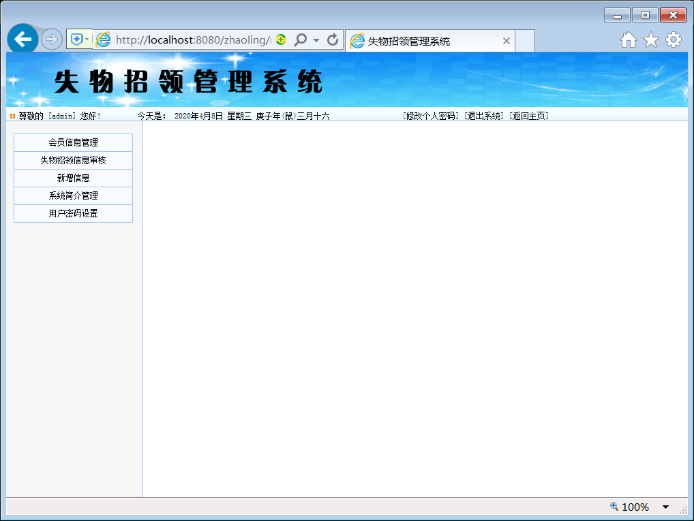

图6.4后台管理主页面

### 6.4.4 新增新闻公告管理模块

管理员对新闻公告的信息进行管理。此页对应的磁盘文件为addnews.jsp，此页的页面设计如图6.5所示：

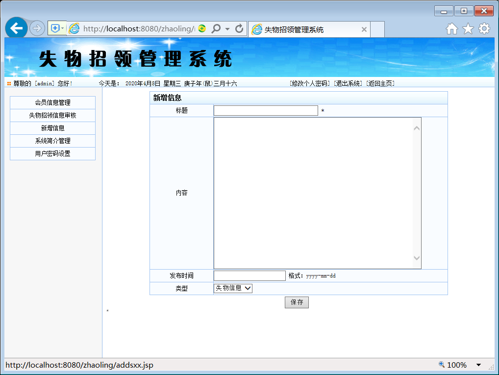

图6.5新增新闻公告管理页面

其中“保存”按钮对应的代码设计如下：

String op=DateFormate.toGb((String)request.getParameter("op"));

String bh,bt,nr,fbsj,lx;

int li_count=0;

newsop neop=new newsop();

if("del".equals(op)){

bh=DateFormate.toGb((String)request.getParameter("bh"));

neop.delete(bh);

%\>

\<script language="javascript"\>

alert("操作成功");

document.location.href="newsmanager.jsp";

\</script\>

\<%

}else if("mod".equals(op)){

bh=DateFormate.toGb((String)request.getParameter("bh"));

%\>

\<script language="javascript"\>

alert("操作成功");

document.location.href="newsmanager.jsp";

\</script\>

\<% }else if("sh".equals(op)){

bh=DateFormate.toGb((String)request.getParameter("bh"));

neop.sh(bh);

%\>

\<script language="javascript"\>

alert("操作成功");

document.location.href="newsmanager.jsp";

\</script\>

\<%}else if("add".equals(op)){

bh=DateFormate.getId();

bt=DateFormate.toGb((String)request.getParameter("bt"));

nr=DateFormate.toGb((String)request.getParameter("nr"));

fbsj=DateFormate.toGb((String)request.getParameter("fbsj"));

lx=DateFormate.toGb((String)request.getParameter("lx"));

String sid = (String)session.getAttribute("s_username");

neop.add(bh,bt,nr,fbsj,lx,sid);

%\>

\<script language="javascript"\>

alert("操作成功");

document.location.href="newsmanager.jsp";

\</script\>

\<% }

### 6.4.5 失物招领审核信息管理模块

在导航栏中点击失物招领审核管理链接，进入审核管理页面。页中显示所有信息，点击审核完成审核信息操作。此页对应的磁盘文件为newsmanager.jsp，本页的页面设计如图6.6:

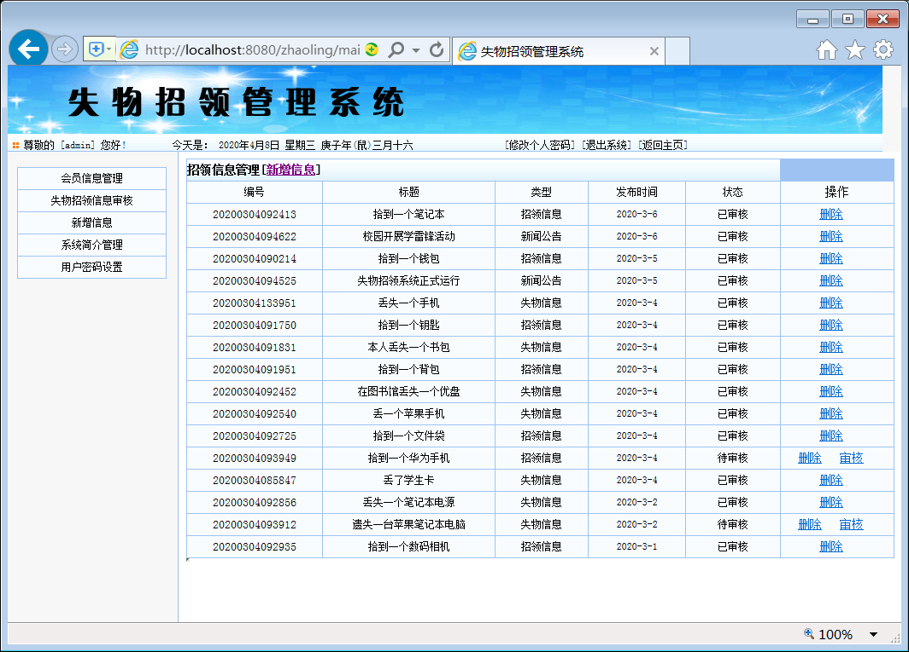

图6.6审核信息管理模块

### 6.4.6 系统简介管理模块

系统简介管理模块中，对系统简介信息进行管理。此页对应的磁盘文件为gg.jsp，此页的页面设计如图6.7所示：

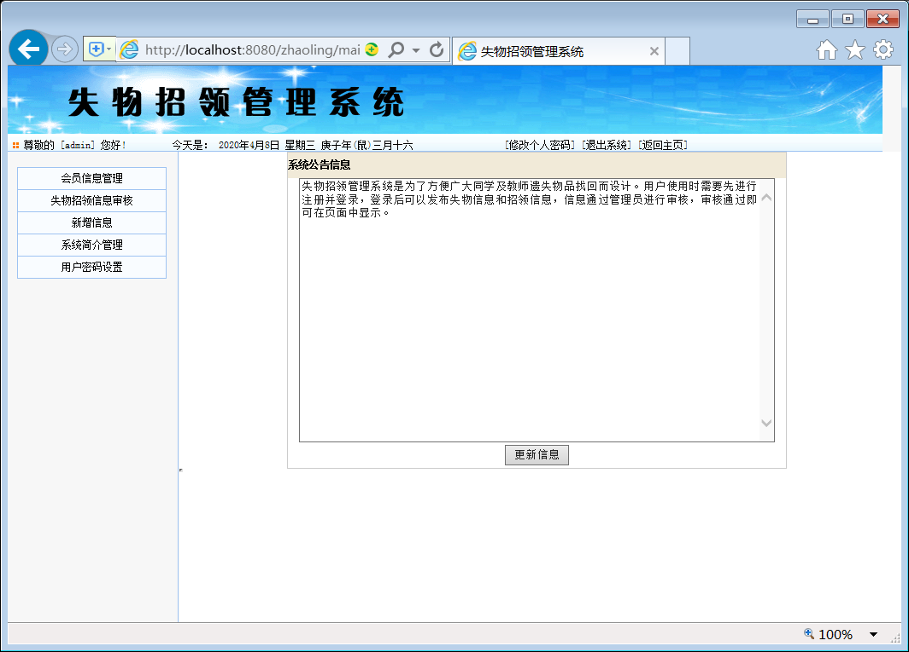

图6.7系统简介管理模块页面

其中“更新信息”按钮对应的代码设计如下：

if("save".equals(op)){

GgManager gm=new GgManager();

String ggnr=DateFormate.toGb((String)request.getParameter("ggnr"));

String fbsj=DateFormate.toGb((String)request.getParameter("fbsj"));

gm.setGg(ggnr,fbsj);

%\>

\<script language="javascript"\>

alert("公告更新成功！");

\</script\>

### 6.4.7 会员信息管理模块

会员信息管理模块完成注册会员信息的新增、删除功能。

1．会员信息管理主页面，此页对应的磁盘文件为sxxmanager.jsp，本页的页面设计如图6.8:

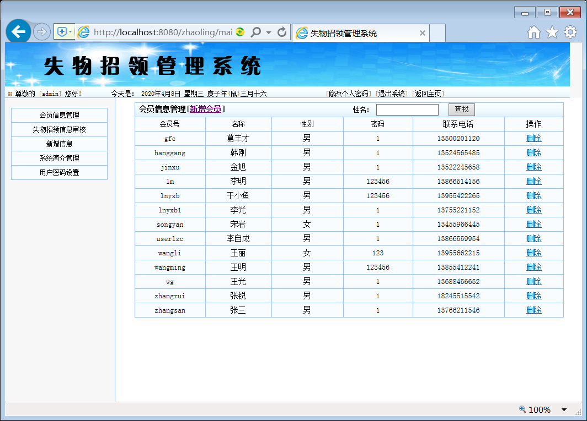

图6.8会员信息管理模块

2．在会员信息管理主页面中点击新增会员按钮，进入新增会员信息页面。此页对应的磁盘文件为addsxx.jsp，本页的页面设计如图6.9:

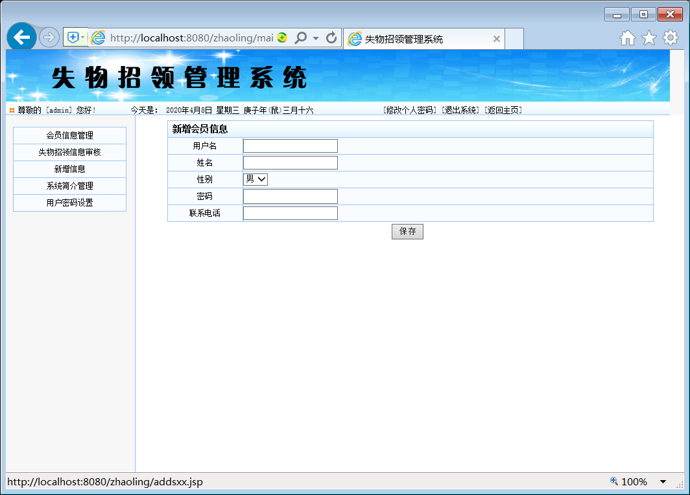

图6.9新增会员信息管理模块

其中“确定”按钮对应的代码如下：

String op=DateFormate.toGb((String)request.getParameter("op"));

String sid,sname,sxb,sbj,ssfz;

sxxop sxx=new sxxop();

if("add".equals(op)){

sid=DateFormate.toGb((String)request.getParameter("sid"));

sname=DateFormate.toGb((String)request.getParameter("sname"));

sxb=DateFormate.toGb((String)request.getParameter("sxb"));

sbj=DateFormate.toGb((String)request.getParameter("sbj"));

ssfz=DateFormate.toGb((String)request.getParameter("ssfz"));

sxx.add(sid,sname,sxb,sbj,ssfz);

%\>

\<script language="javascript"\>

alert("操作成功 请到网站首面登陆");

document.location.href="index.jsp";

6.5 前台系统的实施
------------------

前台系统是面向所有人员的，为浏览者提供新闻公告信息、系统简介信息、失物信息、会员注册、招领信息等功能。不需登陆系统即可浏览上述信息。同时为会员、管理员提供登陆功能。此页对应的磁盘文件为index.jsp，前台主页面设计如图6.10所示：

图6.10前台主页面

### 6.5.1会员注册模块

没有登陆系统时，可以浏览各种信息。会员注册登陆系统后可以发布失物和招领信息。在注册页面中输入会员的姓名、用户名、密码、性别、联系电话完成注册操作。此页对应的磁盘文件为addsxx2.jsp，此页的设计如图6.11所示：

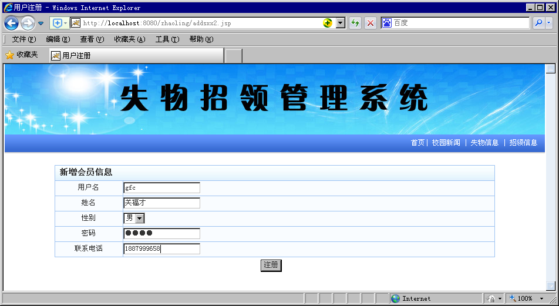

图6.11注册页面

其中“确定”按钮的代码设计如下：

String op=DateFormate.toGb((String)request.getParameter("op"));

String sid,sname,sxb,sbj,ssfz;

sxxop sxx=new sxxop();

if("add".equals(op)){

sid=DateFormate.toGb((String)request.getParameter("sid"));

sname=DateFormate.toGb((String)request.getParameter("sname"));

sxb=DateFormate.toGb((String)request.getParameter("sxb"));

sbj=DateFormate.toGb((String)request.getParameter("sbj"));

ssfz=DateFormate.toGb((String)request.getParameter("ssfz"));

sxx.add(sid,sname,sxb,sbj,ssfz);

%\>

\<script language="javascript"\>

alert("操作成功 请到网站首面登陆");

document.location.href="index.jsp";

### 6.5.2 会员操作主页面

会员注册后，登陆系统进入会员操作主页面。此页对应的磁盘文件为main.jsp，此页的页面设计如图6.12所示：

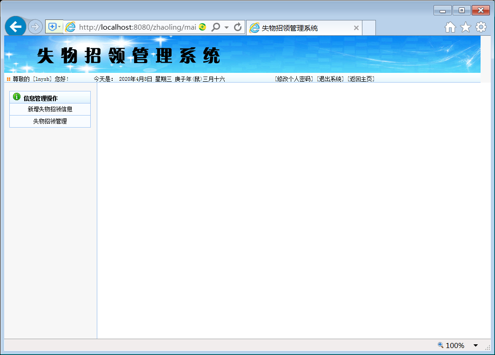

图6.12会员操作主页面

### 6.5.3 新增失物招领页面

登陆系统的会员发布失物招领信息。此页对应的磁盘文件为addnewsgr.jsp，此页的页面设计如图6.13所示：

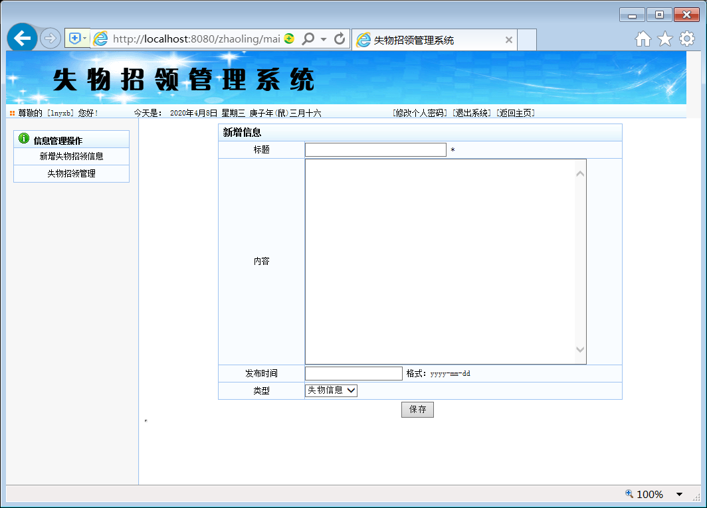

图6.13新增失物招领信息页面

### 6.5.4 失物招领管理页面

会员管理发布的失物招领信息。此页对应的磁盘文件为newsmanagergr.jsp，此页的页面设计如图6.14所示：

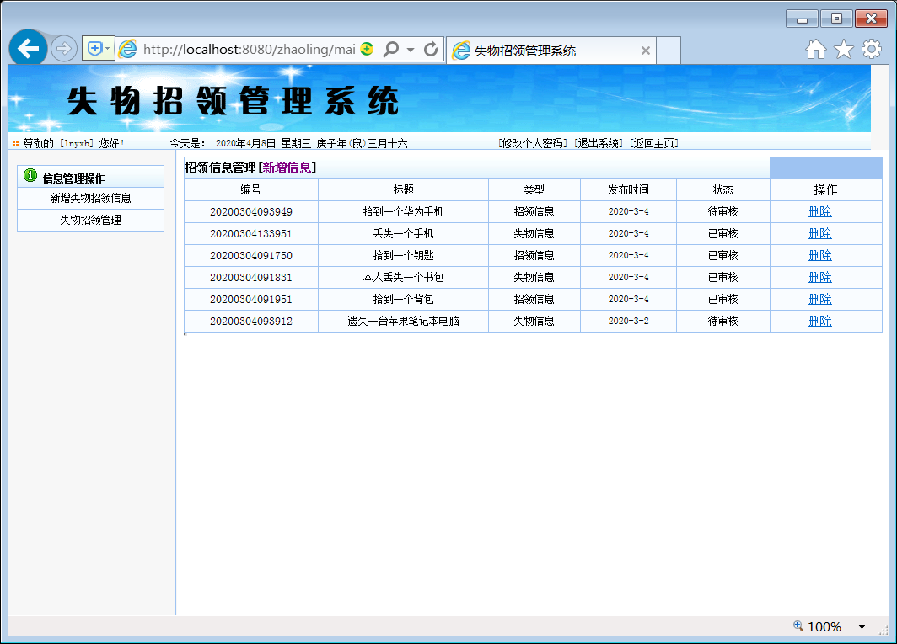

图6.14失物招领管理页面

### 6.5.5 修改密码页面

会员修改个人密码。此页对应的磁盘文件为modipass.jsp，此页的页面设计如图6.15所示：

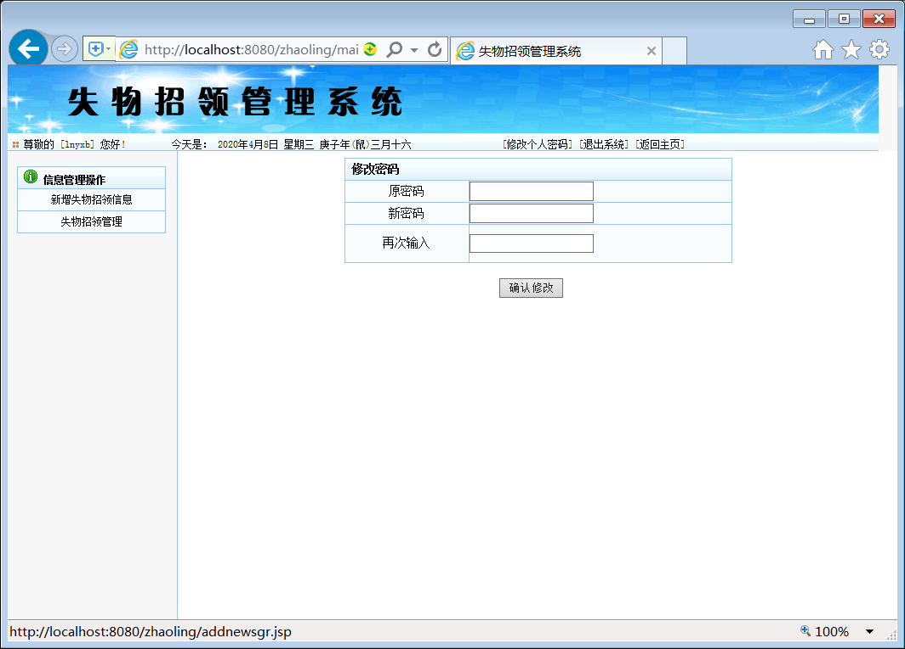

图6.15修改密码页面

6.6 网站的运行环境
------------------

网站制作完成后，要将网站发布到网上，才能实现其价值。系统发布的过程如下（为了顺利开发本系统，建议的操作系统为Win10）。

本系统的软件配置：

数据库：SQL SERVER2008

操作系统：Win10。

Web服务器：Tomcat8.5

只需将网站的文件夹考入到\\Apache Software Foundation\\Tomcat8.5
\\webapps目录中即可。

运行SQL SERVER启动数据库服务器，运行Configure
Tomcat8.5启动Tomcat8.5服务器。在浏览器中输入地址http://127.0.0.1:8080/zhaoling（文件夹名称）即可使用系统了。

 7 测试与维护
================

7.1 测试的任务及目标
--------------------

### 7.1.1 测试的任务

>   在软件投入生产性运行之前，尽可能多地发现软件中的错误。

### 7.1.2 测试的目标

1.  测试的目的是为了发现程序中的错误而执行程序的过程。

2.  好的测试方案是极可能发现迄今为止尚未发现的错误的测试方案。

3.  成功的测试是发现了到今为止尚未发现的错误的测试。

7.2 测试方案
------------

设计测试方案是测试阶段的关键技术问题。所谓测试方案包括预定要测试的功能。应该输入的测试数据和预期的结果，目标是设计一组可能发现错误的数据。测试有两种方法：黑盒测试和白盒测试。

黑盒测试又称为功能测试，在程序接口进行，只检查程序功能是否能够按照规格说明书的规定正确使用，程序是否能适当地接收输入数据并发生正确的输出信息，而且要能够保持外部信息的完整性。

白盒测试又叫结构测试，完全了解程序的结构和处理过程，这种方法按照程序内部的逻辑测试程序，检验程序中每条通路是否都能按照预定要求正确工作[1]。

本系统开发过程进行的测试步骤如下：

### 7.2.1 模块测试：

也叫单元测试，目的是保证每一个模块作为一个单元能正确运行，本测试所发现的往往是编码和详细设计的错误，主要评价模块的下述五个特点：

1.  模块接口； 2.局部数据结构;

>   3.重要的执行路径; 4.出错处理通路;

>   5.影响上述各方面特性的边界条件.

模块测试主要由代码审查和软件测试两部分组成[1]。

### 7.2.2 集成测试：

包括系统测试和子系统测试。集成测试是组装软件的系统技术，主要目标是发现与接口有关的问题。集成测试有两种方法：非渐增式和渐增式，但比较而言，渐增式方法比较好，因为：

1.  编写的测试软件较少，开销较小。

2.  较早地发现模块间的接口错误。

3.  错误位置容易判断。

4.  测试更彻底。

因此，本系统集成测试采用渐增式测试中的混合法，即对软件结构中较上层使用自顶而下的测试方法，而对软件结构中较下层，使用的是自底向上方法，两者结合，这是对模块较多时测试的一种折衷方法。

### 7.2.3 验收测试：

这一步是验证软件的有效性。目的是向未来的用户表明系统能够象预定的那样工作，验收测试一般使用黑盒测试法，验收测试有两种可能的结果。

1.  功能和特性与用户的要求有差距。

2.  功能和性能与用户要求一致，软件是可以接受的。

这个阶段发现的问题往往和需求分析阶段的差距有关。

### 7.2.4 平行运行

所谓平行运行就是同时运行。新开发出来的系统和将被它取代的旧系统，以便比较新旧两个系统的处理结果。目的有：

1.  可以在准生产环境中运行新系统而有不冒风险；

2.  用户能有一段熟悉新系统的时间；

3.  可以验证用户指南和使用手册之类的文档；

4.  能够以准生产模式对新系统进行全负荷测试，可以用测试结果验证性能指标。

7.3 系统维护
------------

软件维护是软件生命周期的最后一个阶段，处于系统投入生产性运行以后的时期中，所谓软件维护就是在软件已经交付使用之后，为了改正错误或满足新的需要而修改软件的过程。软件的维护有适应性维护；完善性维护；改正性维护；预防性维护。

本系统为适应维护的需要，采用如下措施：

1.  软件配置程序源代码；

2.  开发过程文档齐全；

3.  设计过程中各模块均考虑或预留完整性和可维护性接口等部分。

4.  本软件的模块化，详细设计的文档、源代码内部的文档有详细说明、注释均可提高可维护性；

5.  尽量松散〈低偶合〉，高内聚。
